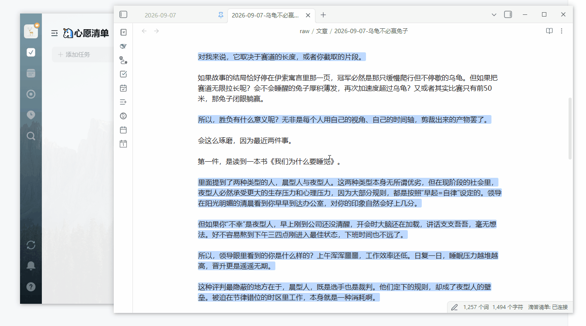
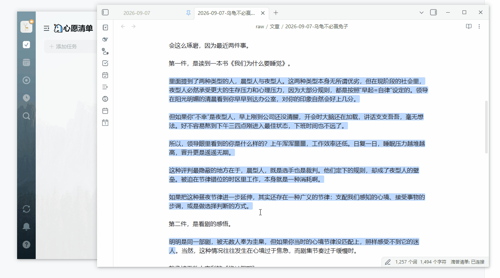

# Selection to Dida (选中文字 → 滴答任务)

Obsidian 插件：在编辑视图/阅读视图**选中文字后右键**，即可把选中内容添加为 Dida365 / TickTick 任务。

## 功能

- 编辑器右键菜单（编辑视图）与全局右键兜底（阅读视图）均可触发；
- 任务标题自动清理书名号等装饰符号（`《我们为什么要睡觉》` → `我们为什么要睡觉`）；
- 选择目标清单（收集箱 / 学习安排 / 生活日常…）；
- 建任务前弹出**理由输入框**：可填写"为什么加入"，也支持一键插入右键时的笔记选中文字；
- 任务备注自动附带来源笔记链接：`来源：[[笔记路径]]`；
- 复用 DidaSync 插件的连接与同步管线（`app.plugins.plugins["didasync"]`），不自行管理 OAuth/token。

## 使用流程

1. 在笔记中选中文字（如《我们为什么要睡觉》）；
2. 右键 → 「添加任务『我们为什么要睡觉』」；
3. 选择清单 → 填写理由（可留空）→ 回车 / 点「添加任务」；
4. 到 Dida / TickTick 查看任务。

## 演示

## 依赖

- [DidaSync](https://github.com/CYZice) 插件需已安装、启用并完成 OAuth 登录（本插件调用其实例方法建任务）。

## 安装（开发/手动）

把 `main.js`、`manifest.json` 放入 `<vault>/.obsidian/plugins/selection-to-didaTask/`，
在 Obsidian「设置 → 第三方插件」中启用。

## 从源码构建

本插件为无构建依赖的手写 CommonJS，修改 `main.js` 后无需打包，直接生效；
重新加载插件（设置里关闭再开启）即可。

## 联系我

- 邮箱：`mail:` divaliu1408@qq.com

## License

MIT
